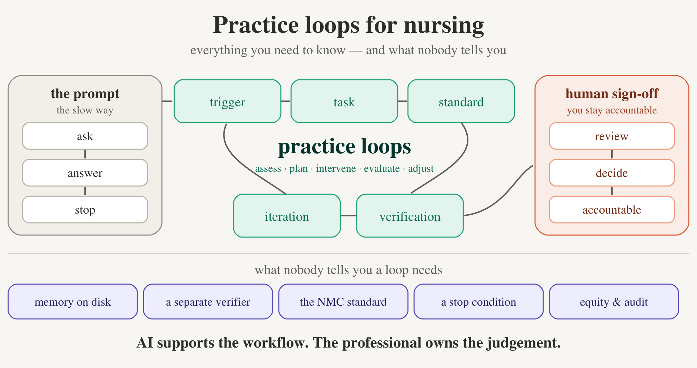

<div align="center">

# 🩺 Practice Loops for Nursing

### Safe, governed AI workflows for nurses — as a Claude Code plugin

*From the [Clinical Quality Artificial Intelligence (CQAI)](https://github.com/Clinical-Quality-Artifical-Intelligence) “Nurse as Citizen Developer” movement.*

[](LICENSE)
[](https://code.claude.com/docs/en/plugins)


<br/>



</div>

---

## What is a Practice Loop?

A **Practice Loop** is a repeatable, AI-supported nursing workflow with a *job, a standard, and a stopping rule*. Instead of one-off prompting, each loop drives Claude through six pillars —

> **Trigger → Task → Standard → Verification → Iteration → Human Sign-Off**

— printing a 10-point verification score, self-correcting anything below 8/10, halting on risk, and writing an **audit trail** to disk.

> **AI supports the workflow; the registered professional owns the judgement.**

It maps directly onto the nursing process you already use: **Assess → Plan → Intervene → Evaluate → Adjust.**

---

## 🔁 The loops

| Skill | Turns this… | …into a DRAFT |
|---|---|---|
| 🎓 `placement-support` | placement meeting notes | SMART action plan separating learning needs from conduct concerns |
| 🌱 `preceptorship` | preceptee progress logs | 3-month review: confidence map + evidence gaps + reflective prompts |
| 💬 `clinical-supervision` | supervision notes | restorative follow-up record: themes, actions, prompts |
| ⚖️ `edi-intelligence` | aggregate workforce metrics | equity briefing using rate-based fair comparison |
| 📚 `teaching` | a topic + audience level | session resource mapped to NMC proficiencies, with inclusive adjustments |
| ✅ `action-tracking` | a meeting transcript | governance-ready action log; risks flagged for human grading |
| 🧭 `practice-loop-method` | — | the shared method that anchors all of the above |

Each loop ships with an anonymised example and a sample audit log in [`examples/`](examples/).

---

## 🚀 Install

In Claude Code:

```text
/plugin marketplace add Clinical-Quality-Artifical-Intelligence/practice-loops
/plugin install practice-loops
```

Then invoke a loop by name — e.g. `/practice-loops:placement-support` — or in natural language: *“run a placement support loop on these notes.”*

---

## ⚠️ Clinical-safety note

> - **Anonymised inputs only.** Never paste identifiable patient or staff data — the loops halt and ask if they detect it. No AI tool may process identifiable data without your organisation's Information Governance (IG) approval.
> - **Every output is a DRAFT** pending sign-off by a named registered professional. The loop never finalises.
> - **Never** use a loop to decide pass/fail or fitness to practise, diagnose or treat, determine mental capacity, or make final safeguarding, disciplinary, or employment decisions.
> - This is **not a medical device** and does not replace professional judgement. The audit log records what the assistant did; it is not an independent assurance check.

---

## 🛠️ Local development

```bash
claude --plugin-dir ./plugins/practice-loops    # load without installing
# then /reload-plugins after edits
python3 scripts/validate.py                      # structural test harness
claude plugin validate ./plugins/practice-loops  # official validator
```

Adding a loop? See [CONTRIBUTING.md](CONTRIBUTING.md).

---

## 📚 Background & framework

The full framework — the master guide, playbook, copy-paste templates, the infographic, and the source decks — lives in [`docs/framework/`](docs/framework/). The design spec and implementation plan are in [`docs/superpowers/`](docs/superpowers/).

---

<div align="center">

**Apache-2.0** · © 2026 Clinical Quality Artificial Intelligence · Practice Loops framework by Lincoln Gombedza

<sub>Technology teams build platforms, but nurses understand practice.</sub>

</div>
