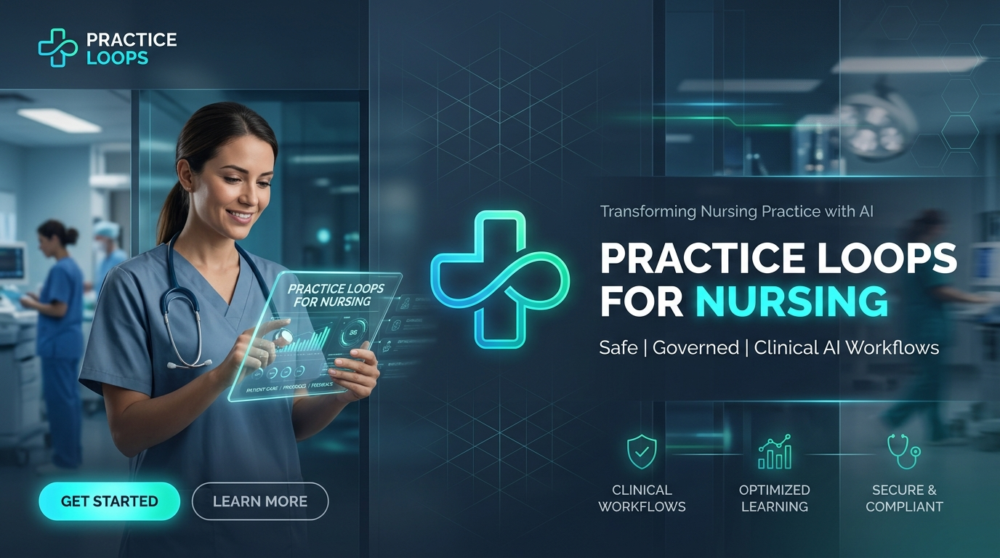

<div align="center">



# 🩺 Practice Loops for Nursing
### Safe, Governed AI Workflows for Registered Nurses — as a Claude Code Plugin

*From the [Clinical Quality Artificial Intelligence (CQAI)](https://github.com/Clinical-Quality-Artifical-Intelligence) "Nurse as Citizen Developer" movement.*

<br/>

[](https://github.com/Clinical-Quality-Artifical-Intelligence/practice-loops/actions/workflows/validate.yml)
[](LICENSE)
[](https://code.claude.com/docs/en/plugins)
[](plugins/practice-loops/skills/)
[](docs/framework/ADPIE-DUAL-GATE-GOVERNANCE.md)
[](SECURITY.md)

</div>

---

## 🌟 What is a Practice Loop?

A **Practice Loop** is a repeatable, AI-supported nursing workflow with a *job, a standard, and a stopping rule*. Instead of unstructured one-off prompting, every loop executes an evidence-based **ADPIE Dual-Gate Governance Model**:

```
 📥 ASSESS           🛑 GATE 1 (HITL)         📐 PLAN & INTERVENE        🔍 EVALUATE        🛑 GATE 2 (HITL)
[Raw Trigger Data] ➔ [Nurse Validates]    ➔ [AI Drafts Standard]  ➔ [Verification] ➔ [Final Sign-Off]
                     (Diagnostic Reasoning)   (NMC / Policy Mapped)    (/10 Score Check)   (& Audit Log)
```

> 🛡️ **Core Principle**: *AI supports cognitive synthesis; the registered professional owns clinical diagnosis, judgment, and sign-off.*

---

## ⚡ Key Features at a Glance

<table>
  <tr>
    <td width="50%" valign="top">
      <h3>🛡️ Dual-Gate Human Governance</h3>
      <p>Includes mandatory Human-in-the-Loop (HITL) gates at the <b>Diagnosis stage</b> (Gate 1) and <b>Final Sign-Off</b> (Gate 2), ensuring strict compliance with NMC standards.</p>
    </td>
    <td width="50%" valign="top">
      <h3>🔒 Clinical Data Safety & HALT</h3>
      <p>Built-in automatic detection for patient-identifiable data. Immediately halts execution if raw identifiable details are detected.</p>
    </td>
  </tr>
  <tr>
    <td width="50%" valign="top">
      <h3>📈 Self-Correcting Verification</h3>
      <p>Every loop self-scores its output against a 10-point clinical standard. Scores below 8/10 trigger up to 3 automatic refinement iterations.</p>
    </td>
    <td width="50%" valign="top">
      <h3>📁 Permanent Disk Audit Trail</h3>
      <p>Automatically records timestamps, loop version, registrant ID, and verification scores to <code>./practice-loop-audit/</code> for governance.</p>
    </td>
  </tr>
</table>

---

## 🔁 The 12 Practice Loops

<details open>
<summary><b>📋 Click to Expand / Collapse Full Loop Suite</b></summary>

<br/>

| Category | Skill Command | Input (Trigger) | Output (Governance DRAFT) |
|---|---|---|---|
| 🏥 **Clinical Governance** | `action-tracking` | Meeting transcript | Governance-ready action log; safety risks flagged |
| 🏥 **Clinical Governance** | `incident-reflection` | Incident / near-miss notes | Structured Datix-aligned reflection & system learning |
| 📋 **Policy & Practice** | `policy-to-practice` | Trust policy / guideline | Ward-level plain English implementation guide |
| 🎓 **Education & Support** | `placement-support` | Student placement notes | SMART action plan separating learning vs conduct |
| 🌱 **Education & Support** | `preceptorship` | Preceptee progress log | 3-month review: confidence map & evidence gaps |
| 📚 **Education & Support** | `teaching` | Topic & audience level | NMC-aligned session plan with inclusive adjustments |
| 💬 **Supervision & Well-being**| `clinical-supervision` | Supervision notes | Restorative follow-up record with themes & actions |
| ♿ **Supervision & Well-being**| `reasonable-adjustments-passport` | Employee adjustment notes | Completed Reasonable Adjustments Passport draft |
| ⚖️ **Workforce & Equity** | `edi-intelligence` | Workforce metrics | Rate-based equity briefing (per 100 staff) |
| 🪞 **Professional Revalidation**| `reflective-practice` | Clinical event reflection | Gibbs / ERA structured reflection mapped to NMC Code |
| 📝 **Professional Revalidation**| `revalidation` | Hours & CPD summary | Complete NMC revalidation submission draft |
| 🔄 **Meta-Method** | `practice-loop-method` | Clinical scenario idea | Custom 6-pillar Practice Loop definition |

</details>

---

## 🚀 Quick Start Guide

### 1. Install the Plugin

In **Claude Code**, install directly from GitHub:

```bash
/plugin install https://github.com/Clinical-Quality-Artifical-Intelligence/practice-loops
```

### 2. Run Any Practice Loop

Invoke your desired skill command in chat:

```bash
/placement-support
```

### 3. Dual-Gate Review Flow

```
1. Input Raw Notes ➔ 2. Review Diagnostic Hypotheses (Gate 1) ➔ 3. AI Refinement (/10) ➔ 4. Final Approval (Gate 2)
```

---

## 📊 Scientific & Architectural Foundation

Our Dual-Gate model is grounded in peer-reviewed nursing informatics literature:


*   📖 Read our full evidence synthesis: **[ADPIE Dual-Gate Governance Architecture](docs/framework/ADPIE-DUAL-GATE-GOVERNANCE.md)**
*   🛡️ Read our security disclosure policy: **[SECURITY.md](SECURITY.md)**
*   📜 Review our Code of Conduct: **[CODE_OF_CONDUCT.md](CODE_OF_CONDUCT.md)**

---

## 🤝 Contributing

We welcome contributions from nurses, clinical leaders, and developers!

1. Check open issues or suggest a new loop using our [Issue Templates](.github/ISSUE_TEMPLATE/).
2. Review our [Pull Request Template](.github/PULL_REQUEST_TEMPLATE.md).
3. Run local validation:
   ```bash
   python3 scripts/validate.py
   python3 scripts/check_guardrails.py
   ```

---

## 📜 Licence & Attribution

Licensed under [Apache 2.0](LICENSE). See [NOTICE](NOTICE) for details.

*Built with ❤️ for nursing by the [CQAI](https://github.com/Clinical-Quality-Artifical-Intelligence) "Nurse as Citizen Developer" movement.*
