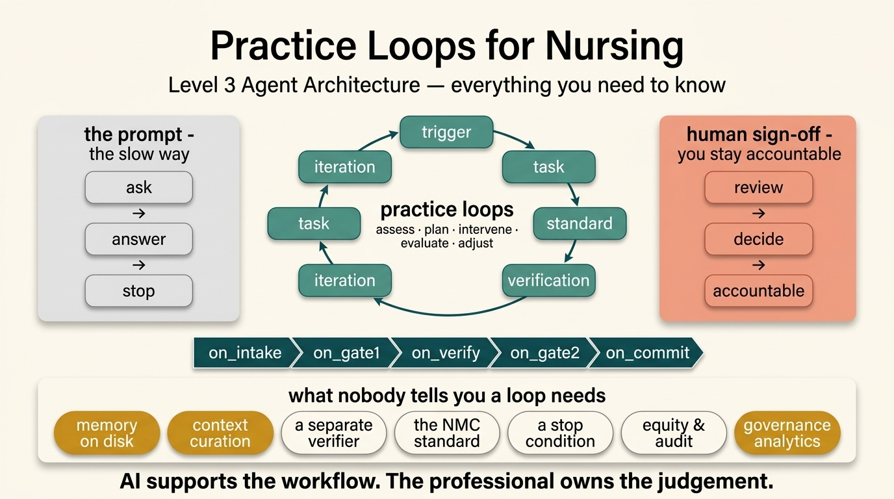

<div align="center">

# 🩺 Practice Loops for Nursing

### Safe, governed AI workflows for nurses — as a Claude Code plugin

*From the [Clinical Quality Artificial Intelligence (CQAI)](https://github.com/Clinical-Quality-Artifical-Intelligence) "Nurse as Citizen Developer" movement.*

[](https://github.com/Clinical-Quality-Artifical-Intelligence/practice-loops/actions/workflows/validate.yml)
[](LICENSE)
[](https://code.claude.com/docs/en/plugins)


[](SECURITY.md)

<br/>



</div>

---

## What is a Practice Loop?

A **Practice Loop** is a repeatable, AI-supported nursing workflow with a *job, a standard, and a stopping rule*. Instead of one-off prompting, each loop drives Claude through six pillars —

> **Trigger → Task → Standard → Verification → Iteration → Human Sign-Off**

— printing a 10-point verification score, self-correcting anything below 8/10, halting on risk, and writing an **audit trail** to disk.

> **AI supports the workflow; the registered professional owns the judgement.**

It maps directly onto the evidence-based nursing process you already use: **Assess → Diagnosis (Human Review Gate 1) → Plan → Intervene → Evaluate → Final Sign-Off (Human Review Gate 2).**

See our scientific foundation document: **[ADPIE Dual-Gate Governance Architecture](docs/framework/ADPIE-DUAL-GATE-GOVERNANCE.md)**.

---

## 🔁 The Loops

| Skill | Turns this… | …into a DRAFT |
|---|---|---|
| ✅ `action-tracking` | a meeting transcript | governance-ready action log; risks flagged for human grading |
| 💬 `clinical-supervision` | supervision notes | restorative follow-up record: themes, actions, prompts |
| ⚖️ `edi-intelligence` | aggregate workforce metrics | equity briefing using rate-based fair comparison |
| 🔍 `incident-reflection` | incident or near-miss notes | structured reflection: what happened, learning, actions |
| 🎓 `placement-support` | placement meeting notes | SMART action plan separating learning needs from conduct concerns |
| 📋 `policy-to-practice` | a policy or guideline | plain-English implementation guide mapped to ward context |
| 🔄 `practice-loop-method` | any clinical topic | a fully structured practice loop definition ready to run |
| 🌱 `preceptorship` | preceptee progress logs | 3-month review: confidence map + evidence gaps + reflective prompts |
| ♿ `reasonable-adjustments-passport` | an employee's adjustment needs | a completed Reasonable Adjustments Passport draft |
| 🪞 `reflective-practice` | a clinical experience or event | a structured reflection using Gibbs or ERA cycle |
| 📝 `revalidation` | practice hours + CPD log | a revalidation submission draft mapped to NMC requirements |
| 📚 `teaching` | a topic + audience level | session resource mapped to NMC proficiencies, with inclusive adjustments |

---

## 🚀 Quick Start

### 1. Install the plugin

In Claude Code, run:

```
/plugin install https://github.com/Clinical-Quality-Artifical-Intelligence/practice-loops
```

### 2. Run a loop

```
/placement-support
```

Claude will prompt you for your notes, run the six-pillar loop, and produce a draft for your review.

### 3. Sign off

Every loop ends with a **human sign-off step**. Claude cannot complete a loop without your explicit confirmation. The output and your sign-off are written to an audit trail file.

---

## 🏗️ How It Works: Dual-Gate Architecture & Lifecycle Events

Every loop execution flows through **five lifecycle phases** and **two human governance gates**:

```
╔══════════════╗    ╔══════════════╗    ╔══════════════╗    ╔══════════════╗    ╔══════════════╗
║  on_intake   ║───►║  on_gate1    ║───►║  on_verify   ║───►║  on_gate2    ║───►║  on_commit   ║
╚══════════════╝    ╚══════════════╝    ╚══════════════╝    ╚══════════════╝    ╚══════════════╝
 PII check &         🛑 GATE 1          Score /10 &          🛑 GATE 2          Audit log &
 task boundaries     Nurse validates     iterate < 8          Nurse approves      memory update
                     reasoning                                DRAFT output        (opt-in)
```

| Step | What Happens | Lifecycle Phase | ADPIE Stage |
|:---:|---|:---:|:---:|
| **1. Trigger** | Nurse initiates — **HALT** if identifiable data detected | `on_intake` | Assess |
| **2. Task** | Bounded job declared; "must NOT decide" boundaries set | `on_intake` | Assess |
| **3. Standard** | NMC proficiency index lookup (context curation — loads only matched proficiencies) | `on_gate1` | Diagnosis |
| | 🛑 **GATE 1** — Nurse validates problem identification & diagnostic reasoning | | |
| **4. Draft** | Output produced (action plan, reflection, review, etc.) | `on_verify` | Plan / Intervene |
| **5. Verify** | 10-point verifier scores printed, weaknesses named | `on_verify` | Evaluate |
| **6. Iterate** | Sub-8 scores revised and re-scored (max 3 rounds) | `on_verify` | Adjust |
| **7. Stop/Escalate** | Halt on safeguarding, patient safety, bias, or insufficient data | `on_gate2` | — |
| **8. Human Sign-Off** | Output marked **DRAFT — pending human sign-off**; accountable role named | `on_gate2` | — |
| | 🛑 **GATE 2** — Nurse reviews and approves the final draft | | |
| **9. Audit Trail** | Timestamped entry written to `./practice-loop-audit/` | `on_commit` | — |
| **10. Memory Update** | Learner trajectory saved to `./practice-loop-memory/` (opt-in, pseudonymised) | `on_commit` | — |

> Maps to the nursing process: **Assess → Diagnosis (Gate 1) → Plan → Intervene → Evaluate → Final Sign-Off (Gate 2)**

---

## 🧠 Level 3 Agent Architecture (Memory, Curation & Governance)

Practice Loops implements a **Level 3 Agent Architecture** (stateless LLM reasoning + persistent state harness & analytics), incorporating three core technical capabilities:

1. 💾 **Stateful Learner Memory (`practice-loop-memory/`)**  
   Tracks pseudonymised preceptee/student development trajectories across sessions (e.g. comparing Month 1 vs Month 3 proficiency progress). Memory is opt-in and stored locally in `.gitignored` JSON files conforming to [`schema.json`](practice-loop-memory/schema.json).

2. ⚡ **Context Curation Engine (`index.json`)**  
   Uses a machine-readable 12-cluster keyword index ([`index.json`](plugins/practice-loops/skills/placement-support/references/proficiencies/index.json)) to dynamically pull *only* the relevant NMC proficiencies into context, preventing LLM token waste and hallucination.

3. 📊 **Cohort Governance Aggregator (`scripts/aggregate_governance.py`)**  
   Parses audit logs in `./practice-loop-audit/` to generate high-level ward and trust quality signals: Gate 2 human sign-off compliance rates, average 10-point verifier scores, safety/escalation flag counts, and top mapped proficiency trends across the cohort.

---

## 📚 NMC Proficiency Database & Assessment Methods

Practice Loops features an embedded **NMC (2018) Standards of Proficiency Reference Database** ([`plugins/practice-loops/skills/placement-support/references/proficiencies/`](plugins/practice-loops/skills/placement-support/references/proficiencies/)) derived from the *NMC Future Nurse Proficiencies*.

Every Practice Loop automatically maps clinical actions, learning needs, reflections, and governance items to:
- **29 Year 1 / Part 1 Proficiencies** (Guided participation in care)
- **12+ Year 2 / Part 2 Proficiencies** (Active participation with minimal guidance)
- **7 Year 3 / Part 3 Proficiencies** (Autonomous practice & team leadership)
- **Safety-Critical Skill Rules (`*`)**: Invasive procedures (e.g. self-harm risk, end-of-life care, ANTT, NGT insertion) require continuous direct supervision even after passing.

### 5 Valid NMC Assessment Methods
AI outputs explicitly assign valid assessment methods based on NMC regulatory guidance:
1. **Direct Observation**: Real-time physical skill demonstration
2. **Discussion**: Clinical reasoning, legal frameworks, and ethical rationale
3. **Simulation**: Experiential lab scenarios, role-play, and emergency simulation
4. **Spoke Placement**: Specialist or cross-area learning opportunities
5. **Feedback**: Input from service users, carers, and multi-disciplinary team members

---

## 📁 Repository Structure

```
.claude-plugin/          Claude Code marketplace manifest
.github/workflows/       CI — validates loop definitions on every push
docs/
  framework/             ADPIE Dual-Gate evidence framework & infographic
  safety/                Safety and risk documentation
  superpowers/           What each loop can do
evals/                   Evaluation harnesses and test cases
examples/                Example inputs and expected outputs
plugins/
  practice-loops/
    skills/              One folder per loop (12 loops)
    hooks/               Pre/post loop hooks
practice-loop-memory/    Persistent learner trajectory memory (local, .gitignored JSON)
practice-loop-audit/     Audit trail logs (local, .gitignored)
scripts/                 Developer utilities & governance aggregator
```

---

## 🛡️ Safety Principles

1. **No patient-identifiable data** — loops process de-identified professional notes only
2. **Dual-Gate Human Governance** — Gate 1 validates diagnostic reasoning; Gate 2 approves final outputs
3. **Audit trail by default** — every run is logged with timestamp, loop version, and sign-off record
4. **Risk escalation built-in** — loops halt and surface concerns rather than proceeding past risk thresholds
5. **NMC-anchored** — every output is mapped to the relevant NMC standard or Code clause

See [SECURITY.md](SECURITY.md) and [ADPIE-DUAL-GATE-GOVERNANCE.md](docs/framework/ADPIE-DUAL-GATE-GOVERNANCE.md) for details.

---

## 🤝 Contributing

See [CONTRIBUTING.md](CONTRIBUTING.md) for how to add a new loop, report a bug, or improve an existing skill.

All contributions must:
- Pass the `validate.yml` CI check
- Include an eval test case in `evals/`
- Include an example in `examples/`
- Maintain the Dual-Gate human review requirement — this is non-negotiable

---

## 📜 Licence

[Apache 2.0](LICENSE) — see [NOTICE](NOTICE) for attribution details.

---

## 🔒 Privacy

See [PRIVACY.md](PRIVACY.md) for data handling principles.

---

*Built with ❤️ for nursing by the [CQAI](https://github.com/Clinical-Quality-Artifical-Intelligence) "Nurse as Citizen Developer" movement.*
